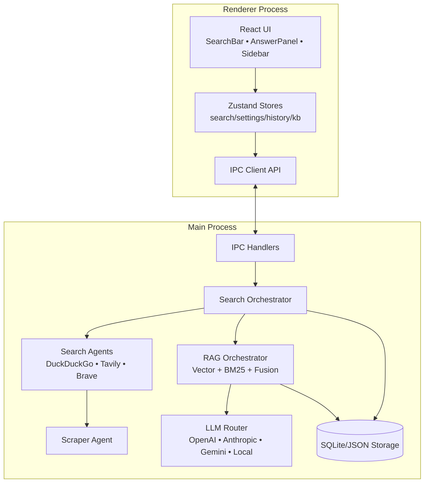
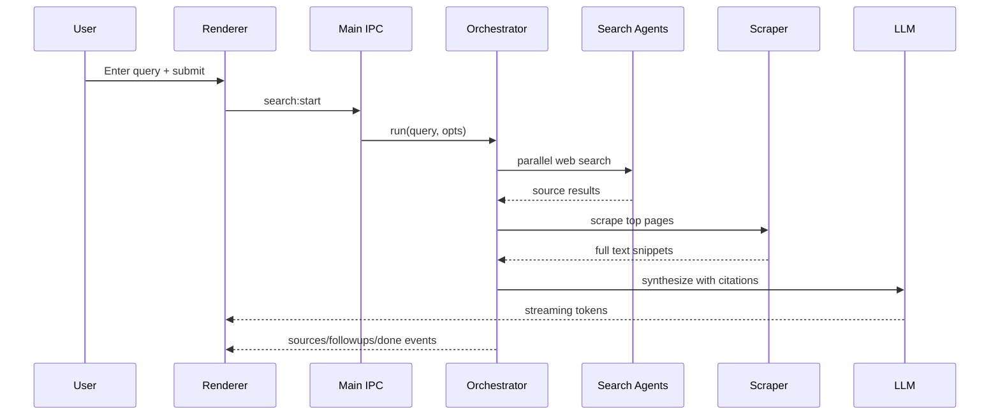
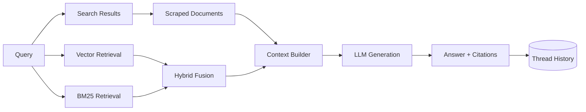

# Lumina Search Architecture

This document provides visual architecture references for contributors.

## Component Diagram

## Search Sequence Diagram

## Data Flow Diagram

## Code Map

- `src/main/agents/` — orchestration, search, scrape, synthesis.
- `src/main/rag/` — retrieval, ingestion, cache, observability.
- `src/main/services/` — settings, analytics, export, scheduler, api server.
- `src/renderer/src/components/` — UI components.
- `src/renderer/src/store/` — app state stores.
- `src/preload/index.ts` — safe IPC bridge.
